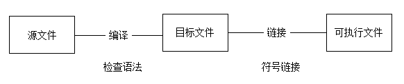
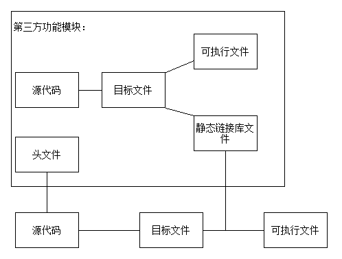

# C++ Primer Plus. I
[CH00.模块编译过程](#ch00.模块编译过程)
    [概述](#概述)
    [实例](#实例)
    [拓展](#拓展)
[CH01.预备知识](#ch01.预备知识)


### CH00. 模块编译过程

#### 概述

一个程序的生成过程：



声明：用于告诉编译器，在这个环境中确实存在某个变量或函数，从而过通过语法的检查，所以说声明的作用主要体现在编译过程中。

定义：给某个变量复制或者定义某个函数的逻辑方法，也就是对应声明的实例。所以说定义的作用主要体现在链接的过程中。

#### 实例

下面看一段代码:

```c++
//test.cpp -- the original version

#include <iostream>

using namespace std;

int add(int, int);

int main() {
    printf("hello world!\n");
    printf("add(3,4)=%d",add(3,4));
}

int add (int a, int b) {
    return a + b;
}
```

这个代码很简单：定义一个加法函数，然后在main()函数中调用它。需要注意的是，这个加法函数的声明和定义是分开的。

现对其进行编译，并使用nm进行解析：

```
$ g++ -c test.cpp

$ nm -C test.o
0000000000000000 b .bss
0000000000000000 d .ctors
0000000000000000 d .data
0000000000000000 p .pdata
0000000000000000 r .rdata
0000000000000000 r .rdata$.refptr._ZNSt8ios_base4InitD1Ev
0000000000000000 r .rdata$.refptr.__dso_handle
0000000000000000 r .rdata$zzz
0000000000000000 R .refptr._ZNSt8ios_base4InitD1Ev
0000000000000000 R .refptr.__dso_handle
0000000000000000 t .text
0000000000000000 r .xdata
000000000000009f t _GLOBAL__sub_I_main
0000000000000041 T add(int, int)
0000000000000055 t __static_initialization_and_destruction_0(int, int)
                 U std::ios_base::Init::Init()
                 U std::ios_base::Init::~Init()
0000000000000000 r std::piecewise_construct
0000000000000000 b std::__ioinit
                 U __cxa_atexit
                 U __dso_handle
                 U __main
0000000000000000 T main
                 U printf
                 U puts
```

> 这里解释下nm命令的输出:
>
> nm命令的输出包含三个部分：
>
> 1. 符号值：认显示十六进制，也可以指定； 
> 2. 符号类型：小写表示是本地符号，大写表示全局符号(external);
> 3. 符号名称
>
> 其中部分符号类型的具体含义如下：
>
> R 只读数据段符号.
>
> S 未初始化数据段中的小目标(small object)符号.
>
> T 代码段的符号.
>
> U 未定义符号.

所以可以看到上面的目标文件中函数main和add都是代码段符号，而printf函数的未定义的符号

现对上面的源码进行一个改动，如下：

```c++
//test.cpp -- remove the definition of add() function

#include <iostream>

using namespace std;

int add(int, int);

int main() {
    printf("hello world!\n");
    printf("add(3,4)=%d",add(3,4));
}
```

因为上面的代码并没有语法错误，所以能够成功通过编译阶段，然后再使用nm命令查看编译生成的目标文件：

```
$ g++ -c test.cpp

$ nm -C test.o
0000000000000000 b .bss
0000000000000000 d .ctors
0000000000000000 d .data
0000000000000000 p .pdata
0000000000000000 r .rdata
0000000000000000 r .rdata$.refptr._ZNSt8ios_base4InitD1Ev
0000000000000000 r .rdata$.refptr.__dso_handle
0000000000000000 r .rdata$zzz
0000000000000000 R .refptr._ZNSt8ios_base4InitD1Ev
0000000000000000 R .refptr.__dso_handle
0000000000000000 t .text
0000000000000000 r .xdata
000000000000008b t _GLOBAL__sub_I_main
                 U add(int, int)
0000000000000041 t __static_initialization_and_destruction_0(int, int)
                 U std::ios_base::Init::Init()
                 U std::ios_base::Init::~Init()
0000000000000000 r std::piecewise_construct
0000000000000000 b std::__ioinit
                 U __cxa_atexit
                 U __dso_handle
                 U __main
0000000000000000 T main
                 U printf
                 U puts
```

可以发现，现在的add函数成为未定义函数了。

如果现在进行链接，那么会出现未定义符号的错误：

```
$ g++ test.o
undefined reference to `add(int, int)'
test.o:test.cpp:(.text+0x24): relocation truncated to fit: R_X86_64_PC32 against undefined symbol `add(int, int)'
collect2: error: ld returned 1 exit status
```

现在创建一个新的文件，命名为add.cc，其代码如下：

```c++
//add.cc -- the definition of add() function

int add (int a, int b) {
    return a + b;
}
```

然后对其进行编译生成目标文件add.o

然后将add.o和test.o链接到一起：

```
$ g++ -c add.cc

$ g++ add.o test.o

$ ./a.exe
hello world!
add(3,4)=7
```

然后可以发现程序能够正常运行。

如果现在再对源码test.cpp进行一个改动，在源码中添加add()函数的定义：

```c++
//test.cpp -- make-up the definition of add() function

#include <iostream>

using namespace std;

int add(int, int);

int main() {
    printf("hello world!\n");
    printf("add(3,4)=%d",add(3,4));
}

int add(int a, int b) {
    return a + b;
}
```

对上面的代码进行编译并使用nm查看目标文件的结果如下：

```
$ g++ -c test.cpp
$ nm -C test.o
0000000000000000 b .bss
0000000000000000 d .ctors
0000000000000000 d .data
0000000000000000 p .pdata
0000000000000000 r .rdata
0000000000000000 r .rdata$.refptr._ZNSt8ios_base4InitD1Ev
0000000000000000 r .rdata$.refptr.__dso_handle
0000000000000000 r .rdata$zzz
0000000000000000 R .refptr._ZNSt8ios_base4InitD1Ev
0000000000000000 R .refptr.__dso_handle
0000000000000000 t .text
0000000000000000 r .xdata
000000000000009f t _GLOBAL__sub_I_main
0000000000000041 T add(int, int)
0000000000000055 t __static_initialization_and_destruction_0(int, int)
                 U std::ios_base::Init::Init()
                 U std::ios_base::Init::~Init()
0000000000000000 r std::piecewise_construct
0000000000000000 b std::__ioinit
                 U __cxa_atexit
                 U __dso_handle
                 U __main
0000000000000000 T main
                 U printf
                 U puts
```

可以发现现在的add()函数又变回了代码符号了，如果现在再将add.o和test.o进行链接，将会出现重定义的错误：

```
$ g++ test.o add.o
multiple definition of `add(int, int)'; test.o:test.cpp:(.text+0x41): first defined here
collect2: error: ld returned 1 exit status
```

#### 拓展

在实现工程代码的时候，通常将声明放在头文件(.h)中，而符号的定义则放在源文件(.cpp/.c/.cc)中。

之所以采用这样的规范是为了减少编译和链接过程中可能出现的错误，并且如果出现错误也可以更好的进行修改。 

根据C/C++编译过程可以得知，如果要调用某个第三方的功能模块，只需要得到这个模块中的所有声明，即可通过编译阶段生成自己的目标文件；在目标文件的基础上再加上第三方功能模块的定义，即可通过链接阶段生成最终的可执行文件。

如下图，就是一个调用第三方功能模块的过程

第三方模块的定义放在头文件 .h 文件中，第三方功能模块的所有定义放在静态链接库 .a 文件中



对于大项目，一个程序往往由很多个目标文件链接生成，现在假设在原来的源代码中添加一个减法函数

```c++
#include <iostream>

using namespace std;

int toAdd(int, int);

int toMinus(int, int);

int main() {
    printf("hello world!\n");
    printf("minus(4,3)=%d\n"toMinus(5,6));
    printf("add(3,4)=%d",toAdd(3,4));
}
```

那么每次编译都需要执行下面的代码：

```
g++ -c add.cc -o add.o
g++ -c minus.cc -o minus.o
g++ -c test.cpp -o test.o
g++ add.o minus.o test.o -o test.exe
```

每增加一个文件，或者说每增加一个目标文件，上面的代码就要增加一行，而每次编译都要执行上面的代码，这显然存在大量的简单重复工作，所以一般把这部分工作交给makefile脚本去做：

```makefile
#Target file : dependcy file
test.exe : test.o add.o minus.o
        g++ test.o add.o minus.o -o test.exe

test.o : test.cpp
        g++ -c test.cpp -o test.o

add.o : add.cc
        g++ -c add.cc -o add.o

minus.o : minus.cc
        g++ -c minus.cc -o minus.o

clean :
        rm -f *.o test.exe
```

直接执行命令make即可完成编译，最终生成test.exe的可执行程序。

显然，如果上面要引入的第三方模块数量很多，写makefile脚本也同样是很麻烦的，所以可以对makefile进行简化

```makefile
#Target file : dependcy file
test.exe : test.o add.o minus.o
        g++ *.o -o test.exe

%.o : %.c
        gcc -c $< -o $@

clean :
        rm -f *.o test.exe
```

执行make命令同样也能一步完成编译过程

### CH01. 预备知识

#### 三种编程思想：

1. 过程化编程：

   这是一种比较旧的编程思想。一般来说，计算机需要处理两个概念，即数据和算法，数据是程序使用和处理的信息，而算法是程序处理数据所使用的方法。过程化编程首先要确定计算机应采取的操作，然后使用编程语言来实现这些操作。程序命令计算机按照一系列流程生成特定的结果。

2. 面向对象编程：

   Object Oriented Programing, OOP。如果说过程化编程强调算法，即处理数据的方法，那么OOP更加强调的是数据，而不是像过程化编程那样，试图使问题满足语言的过程性方法，而是试图让语言来满足问题的要求。其理念是设计与问题本质特性相对应的数据格式。类是一种规范，它描述了这种新型数据格式，对象则是根据这种规范构造的特定数据结构。类规定了可使用哪些数据表示对象以及可以对这些数据执行哪些操作。

   面向对象编程与过程化编程的实质区别在于，并不是将重点放在任务上，而是放在表示概念上。

3. 泛型编程：

   Generic Programing, GP。它与面向对象编程的设计目标都是使重用代码和抽象通用概念的技术更简单。但是OOP强调的是编程的数据方面，而泛型编程强调的是独立于特定的数据类型。术语泛型(Generic)指的是创建独立于类型的代码。泛型编程需要对语言进行扩展，以便可以只编写一个泛型函数（即不是特定类型的函数），并将其用于各种实际类型。

   C++中的模板提供了完成这种任务的机制。

#### OOP概述

这里需要着重介绍一下OOP

##### 面向对象的基本概念

类与对象：用对象来定义类，用类产生对象

A class is a description of a set of objects that share the same attributes, operation, relationships, and sematics.

“共享相同属性、操作、方法、关系或者行为的一组对象的描述符”

An object is an instance created from a class.

“一个对象是根据一个类创建的实例”

类与对象之间的关系实际上就是事物的普遍性与特殊性之间的关系，可以比喻成做蛋糕的模板和某一块特定的蛋糕之间的关系。

> 软件功能是如何完成的？
>
> - 类：定义了对象群体的逻辑结构，包括属性和操作。系统运行时，类作为产生对象的模板，在物理层是不存在的。
> - 对象：系统运行时必须为每一个需要的对象分配内存、保存数据。对象存在于物理层，每个对象都有自己的数据空间(内存）。所有的对象共享一块代码空间。
> - 消息：对象之间的一种交流手段
>
> 每一样东西都是对象，一个程序就是一大群对象，通过消息要求对方做点事。

##### 面向对象的核心特征

- 封装(Encapsulation)：隐藏了对象的实现细节，内部状态不为其他对象所访问，对象的数据只能通过接口访问。

  封装使得对象可以被看作一个“黑盒子”，将对象的数据、属性以及方法封装起来。这样可以保护隐私以及数据安全。最重要的是，这样可以隔离复杂度（内部实现细节不对外公开），比如“空调”封装了制冷的过程，人们只需要按一下制冷的按钮就可调用。

- 继承(Inheritance)：一个类从另一个类那里得到一些属性和行为，并且添加属于自己的额外的属性和行为。

  继承是一种很重要的代码重用的实现手段，所谓代码重用，最常见的就是将一个经常使用的功能封装成一个函数，需要的时候就调用这个函数，这就是最简单的一种代码重用。

- 多态(Polymorphism)：同一类族的接收者可以按照自己的方式处理同一个消息，也就是说同一个类的对象在收到同样的消息后可能会有不同的操作。

  多态的核心思想，也是设计模式的基础就是，使用指向父类的指针或引用，能够调用子类的对象。

聚合与组合(Aggregation/Composition)

这里需要先介绍一下继承所体现的关系，继承表示一个类从另外一个类那里继承了一些特征，这种关系就称为is-a关系，也就是说如果A类从B类继承了一些属性，那么可以说A is a B。

除了is-a关系以外，还有另一种关系，叫做has-a关系，即一个对象是另一个对象的一部分，这种关系是通过聚合或者组合实现的。组合其实是聚合的一种变体，更加强调整体控制着部分的生命。不过实际中聚合与组合之间的区别并不那么明确。

接口与实现(Interface/Implementation)

接口：描述一个类的用户如何与这个类进行交互。

实现：完成接口所定义的功能。

就举一个生活中比较常见的例子来说，电视机、插座、发电厂之间的关系：电视机的运转需要电力，而当要使用电视机时，就需要将电视机插到插座上，而插座能够提供电力，从而使电视机正常运转。这里电视机并不需要插座是如何供电的（风力发电、火力发电、核电等）这些细节与电视机没有关系。

在上面这个例子中，电视机就是用户，插座就是结构，而插座后面的发电厂就是实现。

抽象(Abstraction)

抽象表示一个对象与其他所有对象相区别的基本特征，因此提供了同观察者角度有关的清晰定义的概念界限。简单来讲，抽象就是过滤掉对象的一部分特性和操作，只剩下需要的属性和操作。

抽象是一种思维方式、思维能力，即“抽取比较象的部分出来”。抽象能力实际上就是发现事物普遍性规律的一种能力。

继承的强大，就在于它的抽象和组织技术。客观事物由各种各样的实体（对象）构成，每个对象都有各自的内部状态和运动规律，而根据对象的属性和运动规律的相似性可以将对象分类。

抽象实际就是面向对象领域发现类的主要方法。

#### 可移植性和标准

考虑一种场景，假设在Windows2000 的老式的奔腾PC编写了一个很好用的C++程序，而管理人员决定使用不同的操作系统和处理器的计算机替换它。那么该程序是否还可以在新平台上运行呢？当然，必须使用为新平台设计的C++编译器对程序重新编译。那是否需要修改编写好的代码呢？如果在不修改代码的情况下，重新编译程序后，程序将运行良好，则该程序是可移植的。

可移植性的实现上存在两个障碍：

1. 最直接的障碍就是硬件。硬件特定的程序是不可移植的。将依赖于硬件的部分代码放在函数模块中可以最大限度地降低可移植性问题，这样只需要重新编写这些模块即可。但是一般都会避免这样的编程。
2. 可移植性的第二个障碍就是语言上的差异。计算机语言也可能出现方言。也就是说不同的操作系统对C++的实现可能并不相同。虽然多数实现都希望能其C++版本呢与其他版本兼容，但是如果没有准确描述语言工作方式的公开标准，这将很难做到。

### CH02. 开始学习C++

虎哥：小亮，来给他们整个活儿！(ง ˙o˙)ว

...

小亮出列，并从裤兜掏出手机

...

小亮：艹，走！忽略！！！（后空翻）

/=/=/=/=/=/=/=/=/=/=/=/=/=/=/=/=/=/=/=/=/=/=/=/=/=/=/=/=

这一章节的内容基本上可以忽略，看得出来作者在编写这一章节的时候野心很大（低情商：啥都想讲一点，但啥都没讲好），企图通过一个简单的程序将C++中的所有主要的特性都介绍一遍。

唯一值得注意的地方就只有名称空间的简述和函数定义的一些概念。

#### 名称空间概述

名称空间是一项C++特性，其用途在于帮助程序员编写大型程序以及将多个厂商现有的代码组合起来的程序时更容易，还有助于组织程序。

结合CH00部分的内容，现考虑一个实际场景，如果编写一个大型程序需要用到多个厂商的模块，而这些厂商所提供的模块中都有一个名为func()的函数定义，在进行链接时，编译器将不清楚程序中所使用的函数具体是哪个版本的定义，从而报出重定义的错误。

解决这种问题的方法就是在这两种相同函数名的函数前加上不同的标识符进行区分，从而使编译器知道到底是用哪个版本的定义。

名称空间也就是让厂商额能够将其产品封装在一个叫做名称空间的单元中，这样就可以用名称空间的名称来指出想使用哪个厂商的版本。

> 这里简单介绍一下cout，cout是C++中最常用的输出手段，属于iostream库中的内容，其所属的名称空间为std，使用格式为“cout << output stream;”。cout的具体细节涉及到C++对象的相关内容，所以这里不做详细描述

在有了名称空间后，cout实际上应该写作std::cout，也就是说要告诉编译器cout是属于std名称空间中的一个名称。其中“::”符号称为作用域运算符，用于指出运算符后面的内容所属的作用域。但是也可以使用命令“using namespace std;” 告诉编译器从这行命令以后，所有std名称空间中名称都可用，而不必再使用作用域运算符声明其名称空间。

或者使用命令“using std::cout”，相当于声明了一个变量，声明过后可以直接使用cout，而不必再每次都声明为std::cout。

#### 函数定义的相关概念

C++程序应当在使用函数前提供其函数原型。函数原型对于函数就相当于变量声明对于变量——用于指出设计的类型。

*type function_name(argument list);	//function prototype*

这里的argument-list只需要给出参数类型即可，并不需要给出形参的参数名。

函数原型结尾的分号表明它是一条语句，这使得它是一个原型，而不是函数头。如果省略分号，编译器会把这行代码解释为一个函数头，并且要求接着提供定义该函数的函数体。

*type function_name(argument list)	  //function head
{
	statements										//function body
}*

上面这段代码就是函数的定义，其中第一行被称为函数头，花括号中间部分的内容称为函数体。当然，在给出函数定义的时候需要在函数头中声明形参的参数名。

当然可以在给出函数原型的时候就给出其定义，就和变量初始化一样。

还有一点比较值得注意的是，主函数main()通常声明为返回一个int类型的值，并且函数体结尾语句为return 0，一般来讲，一个函数的返回值最终会返回给调用这个函数的函数，那么主函数main()的返回值返回到哪里呢？答案是，可以将操作系统看作调用main()函数的程序。也就是说，main()的返回值并不是返回给程序的其他部分，而是返回给操作系统。很多操作系统都可以使用程序的返回值，而通常的规定是，退出值为0则意味着程序运行成功，非零则意味着存在问题。

### CH03. 处理数据

#### 简单变量

宽度(width)用于描述存储整数时使用的内存量。使用的内存越多，则宽度越宽。

相较于其他语言中各种类型的固定宽度，C++提供了更加灵活标准，它确保了最小长度，比如：

- short至少16位

- int至少与short一样长

- long至少32位，且至少与int一样长

- long long至少64位，且至少与long一样长

sizeof运算符返回类型或变量的长度，单位为字节。也就是说接受一个类型或者变量作为参数，然后返回这个类型或者变量的长度，单位为字节，需要注意的是，与C语言相比，C++中的sizeof运算符可以省略括号。

C++中的初始化方法：对于简单变量，书中介绍的这些初始化方法未免有些过于花里胡哨了，但是为了避免在遇到这些初始化方法而无法理解的情况，这里还是简单过一遍吧。

```c++
int owls = 101;			//traditional C initialization, set owls to 101
int wrens(432);			//alternative C++ syntax, set wrens to 432
int hamburgers = {24};	//set hamurgers to 24
int emus{7};			//set emus to 7
```

**整型的字面值：**

计算机中的整型字面值有三种常见格式：十进制、十六进制记忆八进制。C++使用字面值的前一（二）位来标识数字常量的基数。如果第一位为1\~9，则基数为10（十进制）；如果第一位是0，第二位为1\~7，则基数为8（八进制）；如果前两位为0x或0X，则基数为16（十六进制）。如下面这段代码：

```c++
#include <iostream>
#include <cstring>

int main() {
    using namespace std;
    int chest = 42;
    int waist = 0x42;
    int inseam = 042;

    cout << "chest = " << chest << " (42 in decimal)\n";
    cout << "waist = " << waist << " (0x42 in hex)\n";
    cout << "inseam = " << inseam << " (042 in octal)";
    return 0;
}
```

上面这段代码的输出为：

```
chest = 42 (42 in decimal)
waist = 66 (0x42 in hex)
inseam = 34 (042 in octal)
```

如果要使用cout以十六进制或者八进制输出数据，则可以使用cout中的一些控制符dec、hex和oct，用于分别指示cout以十进制、十六进制和八进制格式输出整数。需要注意的是，默认格式为十进制，在修改格式之前，原来的格式将一直有效。如下面这段代码：

```c++
#include <iostream>
#include <cstring>

int main() {
    using namespace std;
    int n = 42;
    cout << "n = " << n << "(decimal for 42)\n";
    cout << hex << "n = " << n << "(hexadecimal for 42)\n";
    cout << oct << "n = " << n << "(octal for 42)\n";
    return 0;
}
```

其输出内容如下：

```
n = 42(decimal for 42)
n = 2a(hexadecimal for 42)
n = 52(octal for 42)
```

如果学过C语言，那么这部分内容就没什么需要注意的了，只需要回忆一下部分转义字符，比如退格、反斜杠以及单引号双引号的转义序列表示。（退格就是然光标往回退一个字符的位置，通常结合下划线制作用户读入界面）

还有就是bool类型，C++将非零值解释为true，将零解释为false。

#### const限定符

创建常量的通用格式如下：

*const type name = value;*

需要注意的是，如果在声明的时候没有对const常量进行初始化，那么该常量的值将是不确定的，并且无法修改。

预处理指令#define也能完成常量定义，但是使用const限定符更好，因为const限定符能够指明常量的类型，其次还以利用C++的作用域规则将常量定义限制在特定的函数或者文件中（而不是像#define那样直接将常量的作用域声明为整个文件），最后，const限定符可以用于更加复杂的类型。

#### 浮点数

复习一下C++中科学计数法的表示方法（有时称为E表示法），其外观是这样的：3.45E6，其含义是3.45与$10^6$相乘的结果。

通常cout会自动删除浮点数末尾的零，比如将3.2500000显示为3.25。

但是调用cout.setf()将覆盖这种行为。

在默认的情况下C++会将浮点常量保存为double类型。如果希望常量为float类型，那么需要在浮点常量的后面添加后缀 f 或 F 。如果希望常量保存为long double类型，那么可以添加后缀 l 或 L 。

#### 算术运算符

C++中的算术运算符和C语言中的算术运算符并没有太大区别。

除法分支：不过这里需要注意一下的是，C++中的除法运算符的行为取决于操作数的类型。如果两个操作数都是整数，则C++将执行整数除法。也就是说除法结果的小数部分将被舍弃，使得最后的结果是一个整数。如果其中有一个（或两个）操作数是浮点数值，则除法结果的小数部分将被保留，结果为浮点数。

此外，这里还是需要复习一下递增运算符和递减运算符，它们的功能和C语言中的一样，都是加一或者减一。不过需要注意它们不同的变体，即前缀形式（即运算符在操作数前面）或者后缀形式（即运算符在操作数后面）之间的区别：

```c++
//plus_one.cpp -- the increment operator
#include <iostream>
int main(){
    using std::cout;
    int a = 20;
    int b = 20;
    cout << "a = " << a << "; b = " << b << "\n";
    cout << "a++ = " << a++ << "; ++b = " ++b << "\n";
    cout << "a = " << a << "; b = " << b << "\n";
    
    return 0;
}
```

上面这段代码的执行结果如下：

```
a = 20; b = 20
a++ = 20; ++b = 21
a = 21; b = 21
```

**简单地讲，a++意味着使用a的当前值计算表达式，然后将a的值加1；而++b的意思首先将b的值加一，然后使用新的值来计算表达式。**

**类型转换**

有三种情况C++会执行自动的类型转换：

- 将一种算术类型的值赋给另一种算术类型的变量时

  这里注意一下C++中的列表初始化(list-initialization)方法，也就是前面介绍初始化方法时所描述的那种的通过{}进行初始化的方法。因为这种初始化方法通常用于复杂的数据类型提供值列表，所以对类型转换的要求更严格。具体地说，列表初始化方法不允许缩窄(narrowing)，即变量的类型可能无法表示赋给它的值。比如不允许浮点型数值转换为整型。在不同的整型之间转换或将整型转换为浮点型可能被允许，条件使编译器知道目标变量能够正确地存储赋给它的值。此外，使用列表初始化方法时需要注意，列表中的值（即{}中的数值）必须时常量。

- 表达式中包含不同的类型时

  在这种情况下，C++将执行两种自动转换：首先，一些类型在出现时便会自动转换；其次，有些类型在于其他类型同时出现在表达式中时将被自动转换。

  第一种自动转换，就是C++在计算表达式时，会把bool, char, unsigned char, signed char和short值转换为int类型，这称为整型提升(integral promotion)。

  第二种自动转换，简单的讲就是当运算涉及两种类型时，较小的类型将被转换为较大的类型。类型的大小关系如下：

  long double > double > float > int 

- 将参数传递给函数时

  传递参数时的类型转换通常由C++函数原型控制。不过也可以取消原型对参数传递的控制，尽管这样做并不明智。在这种情况下，C++将对char和short类型执行整型提升。此外，为了保持于传统C语言中大量代码的兼容性，在将参数传递给取消原型对参数传递控制的函数时，C++将float参数提升为double。

执行数值转换时的潜在问题

1. 将较大的浮点类型转换为较小的浮点类型，比如将double类型转换为float类型。潜在的问题是精度会降低，并且原有的数值可能会超出目标类型的取值范围。
2. 将浮点类型转换为整数类型。小数部分丢失（直接截取，而不是四舍五入），原来的值可能超出目标类型的取值范围（因为通过科学计数法计算的数值保存为浮点类型）
3. 将较大的整型转换为较小的整型，比如将long转换为int。原来的值可能超出目标类型的取值范围，通常只复制右边的字节（即从最低位开始复制）

强制类型转换：C++中的强制类型转换并不会修改变量本身，而是创建一个新的、指定类型的值，可以在表达式中使用这个值。强制类型转换的通用格式如下：

*(typeName) value	//C style*

*typeName (value)	//C++ style*

C++11中还提供了一个工具，让编译器能够根据初始值的类型推断变量的类型。

auto是一个C++中的一个关键字，在初始化声明中如果使用关键字auto，而不指定变量的类型，编译器将把变量的类型设置成与初始值相同。

```c++
auto n = 100;		//n is int
auto x = 1.5;		//x is double
auto y = 1.3e12L;	//y is long double
```

处理复杂类型，比如标准模板库(STL)中的类型时，自动类型推断的优势才能显现出来。

### CH04. 复合类型

#### 数组

C++中的数组和C语言中的数组并没有太大的区别，不过这里还是复习下相关知识吧

数组的声明格式如下

*typeName arrayName[arraySize]*

**数组的初始化规则**

只有在定义数组时才能使用初始化，此后就不能使用了，也不能将一个数组付给另一个数组。

比如

```c++
int cards[4] = {3, 6, 8, 10};	//okay
int hand[4];				  //okay
hand[4] = {5, 6, 7, 8};		   //not allowed
hand = cards;				  //not allowed
```

上述代码中情况下，只能通过下标依次给hand数组中的元素进行赋值。

初始化数组时，提供的值可以少于数组的元素的数目，这样编译器将使用提供的数值对前几个数组元素进行初始化。如果只对数组的一部分进行初始化，则编译器将把其他元素设置为0。

如果初始化数组时，没有指定数组元素的数目而只提供了数组的初始化列表的值，那么编译器将自动计算数组的元素个数。

上面的内容基本上属于C语言的部分，而在C++中，还有一些额外的规则：

首先，使用初始化列表进行初始化时，“=”可以省略

其次，可以通过不在初始化列表中提供数值的方法将数组的所有元素初始化为0

最后，正如第三章所讲的，使用初始化列表进行初始化时不允许缩窄转换。

#### 字符串

C++中处理字符串的方式有两种，第一种来自C语言，常被称为C风格字符串(C-styling string)；另一种是基于stirng类库的方法。

##### C-风格的字符串。

C风格的字符串一般都是由字符类型(char)的数组表示，并且都是以空字符(null character)结尾，空字符被写作\0，用以标记字符串的结尾。

```c++
char dog[8] = {'f', 'a', 't', 'e', 's', 's', 'a', '\0'}；
```

上面的这种初始化方法太过于复杂，所以常用的字符数组的字符串初始化方法是，使用双引号将字符串括起，这种字符串被称为字符串常量(string constant)或字符串字面值(string literal)

```c++
char bird[8] = "Bozo";		//the \0 is understood
char fish[] = "Bubbles";	//let the compiler count
```

注意上面代码第一行中的初始化，就和前面所讲的数组初始化一样，当初始化只提供了部分元素的值时，编译器会自动将其余的元素初始化为0，也就是说这行代码等价于

```c++
char bird[8] = {'B', 'o', 'z', 'o', '\0', '\0', '\0', '\0'};
```

需要区分字符常量与字符串常量的区别：

```c++
char ch1 = 'S';	//this is fine
char ch2 = "S";	//illegal type mismatch
```

因为"S"实际上是两个字符'S', '\0'，所以无法用于字符类型的变量初始化。

> 使用C++读取字符串
>
> - cin，它与cout一样，是iostream库中的一个对象，使用格式如下：
>
>   *cin >> targetVar;	//read the input stream to the target variable*
>
>   需要注意的是，**cin使用空白(空格、制表符以及换行符)来确定字符串的结束位置，这意味着cin在获取字符数组输入时只读取一个单词**。读取该单词后，cin将该字符串放到数组中，并自动在结尾添加空字符。
>
> - cin.getline()，getline()是cin对象的一个成员函数，用于读取整行的输入，它使用通过回车键输入的换行符来确定结尾。该函数的有两个参数：第一个参数是用来存储输入行的数组的名称；第二参数是要读取的字符数，如果这个参数是20，则函数最多读取19个字符，余下的空间用于存储自动在结尾处添加的空白符。所以getline()函数在读取了指定数目的字符或遇到换行符时即停止读取。使用格式如下：
>
>   *cin.getline(targetVar, count);	//read a line of string*
>
>   **getline()函数函数通过换行符来确定行尾，但不保存换行符。相反，在存储字符串时，它使用空字符来替换换行符**
>
> - cin.get()，get()是cin对象的另外一个成员函数，也可用读取整行的字符串
>
>   该方法有几种变体（也就是多态，多态，即同一个名称的函数，可以通过不同参数列表而实现不同的定义），其中一种变体与的工作方式与getline()类似，它们接受的参数相同，解释参数的方式也相同，并且都读取到行尾。**但get()方法与getline()方法的区别在于，get()并不会自动使用空白符替换换行符，而是将换行符保留在输入队列中**。基于这一特性，可以通过识别输入流中的下一个字符而判别函数是读取到换行符而停止的，还是读取到指定数目字符后停止的。
>
>   由于get()函数的这一特性，如果需要连续读取两行字符串时将会出现问题，第二个等待接收读取的字符串数组会因为上一次读取留下来的换行符而直接跳过。
>
>   ```c++
>   cin.get(name, ArSize);		//read first line
>   cin.get(dessert, ArSize);	//a problem
>   ```
>
>   解决这个问题的方法就是使用get()方法的另一种变体，即不接受任何参数的get()方法，该方法可以读取一个字符，从而为下一次读取做好准备。
>
>   ```c++
>   cin.get(name, ArSize);		//read the first line
>   cin.get();				   //read a character
>   cin.get(dessert, ArSize);	//read the second line
>   ```
>
>   注：关于get()函数有一个比较高阶的应用技巧，因为cin.get()方法的返回值依然是一个cin对象，所以通过返回的对象调用get()函数，从而将两个成员函数拼接起来（这一技巧在学习重载那一章节时会有一个更深刻的理解），如下
>
>   ```c++
>   (cin.get(name, ArSize)).get();
>   cin.get(dessert, ArSize);
>   ```
>
>   同样的，这样的方法对getline()成员函数也适用。

因为C-风格的字符数使用字符数组表示的，所以无法直接使用等“=”号进行赋值，而只能通过cstring库中的strcpy()进行C-风格字符串之间的赋值。而使用strcat()函数对两个字符串数组进行拼接。

##### string类简介

C++98标准通过添加string类扩展了C++库，因此现在可以使用string类型的变量（面向对象编程的的说法其实也就是对象）来存储字符串，而不需要再使用字符数组。

要使用string类，必须在程序中包含头文件string。string类位于名称空间std中，因此需要提供一条using编译指令，或者使用using std::string命令进行引用。string类定义隐藏了字符串的数组性质，所以能够像处理普通变量那样处理字符串。

下面给出一个使用示例：

```c++
//strtype.cpp -- using the C++ string class
#include <iostream>
#include <string>
int main(){
	using namespace std;
	char charr1[20];
	char charr2[20] = "jaguar";
	string str1;
	string str2 = "panther";
	
	cout << "Enter a kind of feline: ";
	cin >> charr1;
	cout << "Enter another kind of feline: ";
	cin >> str1;
	cout << "Here are some felines:\n";
	cout << charr1 << " " << charr2 << " " << str1 << " " << str2 << endl;
	cout << "The third letter in " << charr2 << " is " << charr2[2] << endl;
	cout << "The third letter in " << str2 << " is " << str2[2] << endl;
    
	return 0;
}
```

通过上面的例子可以了解string类的一些使用方式：

- 可以使用C-风格的字符串来初始化string对象
- 可以使用cin来将键盘输入存储到string对象中
- 可以使用cout来显示string对象
- 可以使用数组表示法来访问存储在string对象中的字符

还可以使用字符串数组为string对象进行赋值。

此外，string类还提供了一些更加简便的操作方法，比如可以直接使用"+"将一个字符串附加在另一个字符串的后面，然后可以使用"="进行string类之间的赋值。

> string对象读取整行字符串的方法，通用格式：
>
> *getline(cin, targetString);*
>
> 这里没有使用句点表示法，表明这里的getline()函数不是类方法。它将cin作为参数，指出到哪里去查找输入，另外，也没有指出字符串的长度，因为string对象根据字符串的长度自动调整自己的大小。
>
> 之所以会有这样的区别是因为，cin其实istream类的一个对象，而istream类在引入string类之前就已经存在了，所以当时并没有考虑到处理string对象的情况。
>
> 但是至于为什么能够使用cin读取一个单词到string对象中，其具体的实现依赖于string类中的一个友元函数。而友元函数的内容到后面再做详细描述。

##### C++中其他形式的字符串

除了char类型外，C++中还有其他的字符类型比如wchar_t, char16_t, char32_t，对于这些字符类型的字符串字面量，C++使用前缀L, u, U分别进行标识

```c++
wchar_t title[] = L"Chief Astrogator";
char16_t name[] = u"Felonia Ripova";
char32_t car[] = U"Humber Super Snipe";
```

此外，C++还支持Unicode字符编码方法UTF-8。在这种方案中，根据编码的数字值，字符可能存储为1\~4个八位组。C++使用前缀u8来表示这种类型的字符串字面值。

C++另一种新增的类型是原始(raw)字符串，在这种字符串中"\n"表示的不再是换行符，而是两个字符 '\\' 和 'n'。C++中的原始字符使用前缀R标识，并用界定符 "( 和 )" 来表示边界，下面是一个代码示例

```c++
cout << R"(Jim "King" Tutt uses "\n" instead of endl.)" << '\n';
```

上面代码的输出内容将是：

Jim "King" Tutt uses "\n" instead of endl.

C++中的原始字符串还有另一种界定符"+\*( 和 )+*\"，用于处理字符串中出现(" ")的特殊情况：

```c++
cout << R"+*("(Who wouldn't?)", she whispered.)+*" << endl;
```

上面代码的输出内容将是：

"(Who wouldn't?)", she whispered.

#### 结构简介

C++中的结构与C语言中的结构被有太大的区别，主要的区别在于C++允许在声明结构变量时省略关键字struct：

```c++
struct inflatable
{
	char name[20];
	float volume;
	double price;
};

struct inflatable goose;	//keyword struct required in C
inflatable vincent;		    //keyword struct not required in C++
```

和数组一样，结构类型变量也可以使用初始化列表进行初始化。

C++使用户自定义的类型与内置类型尽可能相似。比如，可以将结构作为参数传递给函数，也可以让函数返回一个结构。另外，还**可以使用赋值运算符将结构赋值给另一个同类型的结构，这样的结构中每个成员都将被设置为另一个结构中相应成员的值，即使成员是数组**。这种赋值称为成员赋值，将在后面的章节详细描述。

此外，C++也允许指定占用特定位数的结构成员，这使得创建与某个硬件设备上的寄存器对应的数据结构非常方便。字段的类型应为整型或者枚举，接下来是冒号，冒号后面是一个数字，用于指定使用的位数。可以使用没有名称的字段来提供间距。每个成员都被称为位字段(bit field)。下面是一个示例：

```c++
struct torgle_register{
	unsigned int SN : 4;	//4 bits for SN value
	unsigned int : 4;		//4 bits unused
	bool goodIn : 1;		//valid input (1 bit)
	bool goodTorgle : 1;	//successful torgling
};

torgle_register tr = {14, true, false};
```

#### 共用体

略，略略略~

#### 枚举

C++中的枚举有两种用于：第一种是C语言一样，定义一种新的类型；另一种就是创建符号常量，这种方式可以取代const。这里的第二种应用场景到后面的章节再详细描述。

先复习一下C语言中的枚举：

```c++
enum spectrum {red, orange, yellow, green, blue, violet, indigo, ultraviolet};
spectrum band = red;
```

上面个的语句完成两项工作：

- 让spectrum成为新类型的名称；spectrum被称为枚举(enumeration)，就像struct变量被称为结构一样。
- 将red、orange、yellow等作为符号常量，它们依次对应于整型数值0\~7。这些常量叫做枚举量(enumerator)。 

对于枚举，只定义了赋值运算符。也就是说，枚举变量没有算术运算符。

枚举量是整型，可以提升为int类型，但是int类型不能自动转换为枚举类型。

#### 指针和自由存储空间

计算机程序在存储数据时必须跟踪的三种基本属性：

1. 信息存储在何处
2. 存储的值为多少
3. 存储的信息是什么类型

为了达到上述的目的，一种最简单的策略是，定义一个简单变量。声明语句指出了值得类型和符号名，然后让程序为值分配内存，并在内部跟踪该内存单元。

然而另一种更为重要得策略是，以指针为基础。指针是一个变量，其存储的是数值的地址而非数值本身。

> 面向对象编程和传统的面向过程编程除了在模型构建上存在差别，还有另一个区别在于，OOP强调的是在运行阶段（而不是编译阶段）进行决策。运行阶段指的是程序正在运行时，编译阶段指的是编译器将程序组合起来时。运行阶段决策提供了灵活性，可以根据当时的情况进行调整。
>
> 比如，使用OOP时，可以在运行姐u段确定数组的长度。为了使用者何种方法，语言必须允许在程序运行时创建数组，而C++采用的方法时，使用关键字new请求正确数量的内存以及使用指针来跟踪新分配的内存的位置。

使用常规变量时，数值是指定的量，而地址是派生量。

而使用存储数据的新策略则刚好相反，将地址视为指定的量，而将数值视为派生量。因此，指针名表示的是地址，\* 运算符被称为间接值(indirect value)或解除引用(dereference)运算符，将其应用于指针，可以得到该地址处存储的数值。

> 这里讲一下间接引用运算符与递增或递减运算符的优先级关系
>
> 前缀递增、前缀递减运算符和解除引用运算符的优先级相同，以从右到左的方式进行结合。
>
> 前缀运算符从右到左的结合规则意味着\*++pt的含义如下：先将递增运算符应用pt（因为++位于\*的右边），然后将解除引用运算符应用于被递增后的pt。
>
> 另一方面，++\*pt意味着先将解除引用运算符应用于pt，然后在将递增运算符应用于pt指向的值，即先取得pt指向的值，然后将这个值加1；
>
> 后缀递增、后缀递减运算符的优先级相同，都比前缀运算符的优先级高，这两个运算符都是以从左到右的方式进行结合。
>
> 后缀运算符从左到由的结合规则意味着\*pt++的含义如下：后缀运算符比++的优先级更高，这意味着先将递增运算符应用于pt，然而后缀递增运算符意味着先使用pt当前的值然后再对其进行递增，而不是对指针递增后的新地址解除引用，因此\*pt++和\*pt的数值是一样的，但是\*pt++在执行完毕后pt会指向下一个单位。

C++中指针的声明与C语言中的指针声明一样，需要注意下面的语句

```c++
int * p1, p2;
```

这样的声明创建一个名为p1的指针和一个名为p2的int类型的变量。对于每个指针变量名，都需要使用一个\*。

##### 使用new来分配内存

指针真正的用武之地在于实现上面所说的新的存储策略。C++实现这种策略的方法是使用关键字new在运行阶段分配未命名的内存以存储值。在这种情况下，只能使用指针来访问内存。

为一个数据对象（可以是结构也可以是基本类型）获得并指定分配内存的通用格式如下：

*typeName \* pointerName = new typeName;*

这里必须要声明指针所指向的类型的原因之一在于，地址本身只指出了对象存储地址的开始（第一个字节的位置），而没有指出其类型（使用的字节数）。而另一个原因在于，正如前面所说的，存储数值必须跟踪数值的类型，不然程序将不知道如何解释这些数值。

需要指出的是，通过new分配的内存块通常与常规变量声明分配的内存块不同。常规变量声明分配的内存块位于被称为栈(stack)的内存区域中，而通过new分配的内存块则是从被称为堆(heap)或自由存储区(free store)的内存区域中分配内存。

动态内存分配还有一个delete运算符，它使得在使用完内存后，能够将其归还给内存池，归还或者释放(free)的内存可供程序的其他部分使用。使用delete的通用格式如下：

*delete pointerName;*

使用delete会释放指针所指向的内存，但并不会删除指针变量本身。

三个需要注意的点：

- 一定要配对的使用new和delete，如果不释放已分配的内存的话，将发生内存泄漏，也就是说，被分配的内存再也无法进行使用了。如果内存泄露严重，则程序将由于不断寻找更多的内存而终止。
- 不要尝试释放已经释放的内存块，这样做的结果将是不确定的。
- 不能使用delete来释放声明变量所获得的内存。然而，对赋值为nullptr或者NULL的指针使用delete是安全的。

因此，不要创建两个指向同一个内存块的指针，因为这将增加错误地删除两次同一个内存块的可能性。（这个问题会在后面介绍成员赋值时具体体现）

##### 使用new创建动态数组

如果通过声明来创建数组，则在程序被编译时将为它分配内存空间。不管程序最终是否使用数组，数组都在那里，它占用了内存。在编译时给数组分配内存被称为静态联编(static binding)，意味着数组是在编译时加入到程序中的。但使用new时，如果在运行阶段需要数组，则创建它；如果不需要，则不创建。并且还可以在程序运行时选择数组的长度。这被称为动态联编(dynamic binding)，意味着数组是在程序运行时创建的。这样的数组也被称为动态数组(dynamic array)。

使用静态联编时，必须在编写程序时指定数组的长度；使用动态联编时，程序将在运行时确定数组的长度。

使用new创建动态数组的通用格式如下：

*typeName \* pointerName = new typeName [elementsCount];*

当然，由于指针和数组名在使用上有很大的相似性，所以可以像使用一般数组那样使用指针指向的动态数组。

而释放指针指向的动态数组的通用格式如下：

*delete [] pointerName;*

> 创建动态二维数组的通用格式：
>
> *typeName \*\* pointerName = new typeName \* [raw];*
>
> *for(int i = 0; i < raw; i++) {  pointerName[i] = new typeName [col]; }*
>
> 上面这段代码的含义是创建一个以指针为元素的动态数组，创建好这样一个数组后，在使用循环让每个指针指向相应的数组。
>
> 同样的，如果要释放二维数组的内存，也需要使用循环来依次进行释放：
>
> *for(int i = 0; i < raw; i++) {delete [] pointerName[i]; }*

##### 指针和数组

将整型变量加1后，其值将增加1；但将指针变量加1后，增加的量等于它指向的类型的字节数。

而通常情况下，C++将数组名解释为地址，即数组第一个元素的地址。

所以很多情况下，可以用相同的方式使用指针名和数组名，对于它们可以使用数组方括号表示法，也可以使用解除引用运算符：

*arrayName[i] becomes \*(arrayName + i)*

*pointerName[i] becomes \*(pointerName + i)*

不过数组名和指针还是有一些细微的差别，可以修改指针的值，而数组名则是常量，不可修改

```c++
pointerName = pointerName + 1;	//valid
arrayName = arrayName + 1;	    //not allowed
```

另一个区别是，对数组使用sizeof，得到的是数组的长度；对指针使用sizeof，得到的是指针的长度，即使这个指针指向一个数组。

> 此外，对数组名取址时，数组名也不会被解释为其地址。比如下面的情况：
>
> ```c++
> short tell[10];			//tell an array of 20 bytes
> cout << tell << endl;	//displays &tell[0]
> cout << &tell << endl;	//displays address of whole array
> ```
>
> 上面个两行代码的输出在数值上相同的，但从概念上讲，tell(也即&tell[0])是一个2字节内存块的地址，而&tell是一个20字节的内存块的地址。因此，表达式tell+1将地址加2，而表达式&tell+1将地址加20。换句话说tell是一个short指针(short \*)，而&tell是一个这样的指针，即指向包含20个元素的数组(short (*) [10])
>
> 这里之所以使用short (\*) [10]描述&tell的类型，即下面的语句：
>
> ```c++
> short (*pas) [10] = &tell;	//pas points to array of 20 shorts
> ```
>
> 如果省略括号，优先级规则将使得pas先与[20]结合，导致pas是一个short指针数组，它包含10个元素，因此括号是必不可少的。其次，如果要描述变量的类型，可将声明中的变量名删除。因此，pas的类型为short (\*) [10]。另外，由于pas被设置为&tell，因此\*pas与tell等价，所以(\*pas)[0]为tell数组的第一个元素。
>
> 下面代码详细的解释了这种区别：
>
> ```c++
> #include <iostream>
> 
> int main() {
>     using namespace std;
>     short tell[10] = {1, 2, 3, 4, 5};
>     cout << "tell = " << tell << endl;
>     cout << "&tell = "<< &tell << endl;
>     cout << "tell + 1 = " << tell + 1 << endl;
>     cout << "&tell + 1 = " << &tell + 1 << endl;
>     short (*pas)[10] = &tell;
>     cout << "let short (*pas)[10] = &tell" << endl;
>     cout << "pas + 1 = " << pas + 1 << endl;
>     cout << "(*pas) + 1 = " << (*pas) + 1 << endl;
>     cout << "(*pas)[0] = " << (*pas)[0] << endl;
>     cout << "(*pas)[1] = " << (*pas)[1] << endl;
>     return 0;
> }
> ```
>
> 其执行的结果为：
>
> ```
> tell = 0xffffcc20
> &tell = 0xffffcc20
> tell + 1 = 0xffffcc22
> &tell + 1 = 0xffffcc34
> let short (*pas)[10] = &tell
> pas + 1 = 0xffffcc34
> (*pas) + 1 = 0xffffcc22
> (*pas)[0] = 1
> (*pas)[1] = 2
> ```

##### 指针与字符串

cout对象认为char的地址为字符串，因此在使用cout对字符数组进行输出时，会直接打印对应的字符串，然后继续打印后面的字符，直到遇到空字符。

关于字符数组和char类型指针的使用，可以看下面的代码：

```c++
//ptrstr.cpp -- using pointer to strings
#include <iostream>
#include <cstring>

int main(){
    using namespace std;
    char animal[20] = "bear";
    const char * bird = "wren";
    char * ps;
    
    cout << animal << " and ";	//display bear
    cout << bird << endl;	    //display wren
    // cout << ps << endl;	    //may display gabage, may cause a crash
    
    cout << "Enter a kind of animal: ";
    cin >> animal;
    //cin >> ps; Too horrible a blunder to try; ps doesn't point to allocated space
    
    ps = animal;
    cout << ps << "!\n";
    cout << "Before using strcpy():\n";
    cout << animal << " at " << (int *)animal << endl;
    cout << ps << " at " << (int *)ps << endl;
    
    ps = new char [strlen(animal) + 1];
    strcpy(ps, animal);
    cout << "After using strcpy():\n";
    cout << animal << " at " << (int *)animal << endl;
    cout << ps << " at " << (int *)ps << endl;
    delete [] ps;
    
    return 0;
}
```

上面这段代码闯将了一个char数组和两个指向char的指针变量。

注意下面这行代码：

```c++
const char * bird = "wren";		//bird holds address of string
```

“wren”实际上表示的时字符串的地址，因此这条语句将"wren"的地址赋给了bird指针。但同时字符串字面值时常量，所以这里的代码在声明中使用关键字const的原因。

如果对ps进行初始化，那么编译过程不会报错，但是由于此时的ps并没有指向某个被分配的空间，所以这会导致程序在运行阶段出错。

然后看后面的输入动作，正如前面讲过的，使用数组进行输入是安全的。但是使用const char \*指针来读取输入并不合适，原因如下：

- 有些编译器将字符串字面值视为只读常量，如果试图修改他们，将导致运行阶段错误。
- 有些编译器只是用字符串字面值的一个副本来标识程序中所有的该字面值。如果程序只存储字面值的一个副本，那么指针将被设置为指向该字面量的指针，而由于该指针被声明为const，所以编译器会禁止对该指针的指向位置做出改变。

而试图将字符串读入未初始化的指针将更糟糕。由于没有进行初始化，因此并不知道信息将被存储在哪里，这甚至可能改写内存中的信息。

**所以再将字符串读入程序是，应使用已分配的内存地址。该地址可以是数组名，也可以是使用new初始化过的指针。**

因为cout会自动打印字符指针或字符数组名对应的字符串，所以如果要打印字符指针或者字符数组对应的地址时，需要将其强制转换为(int \*)类型的指针。如下面两行代码：

```c++
cout << animal << " at " << (int *)animal << endl;
cout << ps << " at " << (int *)ps << endl;
```

而直接将数组名赋值给指针，只是让指针指向数组对应的地址，而并不会产生新的副本。

如果希望能长生新的副本，那么需要先对指针使用new进行初始化，然后在使用strcpy()函数来复制副本。

#### 变量存储

根据用于分配内存的方法，C++有3种管理数据内存的方式：自动存储、静态存储和动态存储（有时也被叫做自由存储空间或者堆）。

- 自动存储：在函数内部定义的常规变量使用自动存储空间，被称为是自动变量(automatic variable)，这意味着它们在所属的函数被调用时自动产生，在该函数结束时消亡。

  自动变量通常存储在栈中。这意味着执行代码块时，其中的变量讲一次加入到栈中，而在离开代码块时，将按相反的顺序释放这些变量。因此，在程序执行过程中，栈将不断地增大和缩小。

- 静态存储：静态存储是整个程序执行期间都存在的存储方式。使变量成为静态的方式有两种：一种是在函数外面定义它；另一种是在声明变量时使用关键字static。

  自动存储和静态存储的关键在于：这些方法严格地限制了变量地寿命。变量可能存在与程序的整个生命周期（静态变量），也可能只是在特定函数被执行时存在（自动变量）。

- 动态存储：new和delete运算符提供了一种比自动变量更灵活的方法。它们管理了一个内存池，在这C++中被称为自由存储空间(free store)或堆(heap)。该内存池同用于静态变量和自动变量的内存是分开的。

  new和delete运算符允许程序员在一个函数中分配内存，而再另一个函数中释放它。因此，数据的生命周期不完全受程序或函数的生存时间控制。

